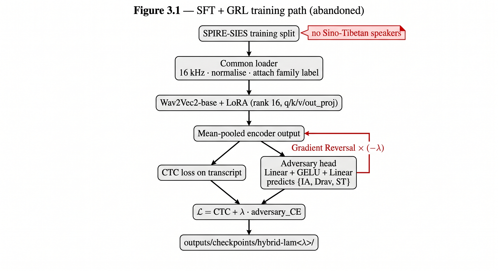
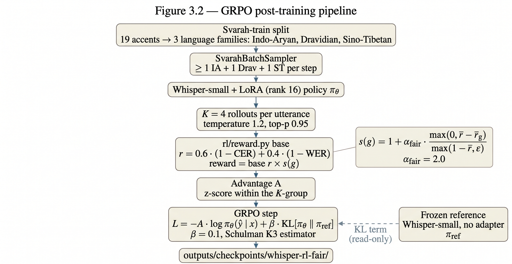

# Phase 2 Report — Towards Fair and Robust Audio Transformers

**Project ID:** PW25_BJD_05
**Title:** Towards Fair and Robust Audio Transformers: A Multi-Strategy Approach to Real-World Audio Understanding
**Team:** Aditya Sharma (PES1UG23CS036), Adithya V Holla (PES1UG23CS026), C Kaustubh (PES1UG23CS154), Aditi Mangala Udaya (PES1UG23CS027)
**Guide:** Dr. Bhaskarjyoti Das
**Semester:** January – May 2026

---

## Abstract

Phase 1 ended with a clean problem statement: Indian-accented ASR systems look passable on overall WER, but the subgroup numbers drift, and the literature rarely tests whether that drift is a real structural effect or statistical noise. Phase 2 is the measurement, the experiments it produced, and the reaction to what they showed.

The evaluation runs on Svarah. We collapse its 19 accents into three language families (Indo-Aryan, Dravidian, Sino-Tibetan) so the Poisson drop-in-deviance test stays stable, and for every model we report ΔDP, ΔEO, and a per-group noise-robustness Δnoise at 10 dB SNR. Every gap comes with a p-value that controls for utterance length. If a gap is 2 points with p = 0.02, it is structural. If it is 2.6 points with p = 0.08, it is noise. The distinction is not rhetorical; it decides whether the number makes it into the report.

The plan from Phase 1 was a GRL adversary on Wav2Vec2 + LoRA. It did not work. Across λ ∈ {0.05, 0.10, 0.30}, ΔDP on Svarah widened from 9.0 pp (no adversary) to as much as 12.5 pp (Table 6.2). The cause is simple once you look at SPIRE-SIES: there are no Sino-Tibetan speakers in it. An adversary cannot reverse a gradient for a subgroup it never sees, and it quietly strips ST-relevant features from the rest. We replaced the approach with GRPO post-training on Whisper-small + LoRA. The reward is WER and CER with a family-need scaling term, and batches are drawn by a sampler that guarantees at least one utterance per family. After 1,500 steps, overall WER on Svarah-eval fell from 18.4 % to 16.4 %, and the Poisson p-value moved from 0.020 to 0.078 (Table 6.3). The baseline has a structural accent gap; the RL model does not. A per-family Δnoise gap is still there and still large (Table 6.4), and Chapter 7 explains what we plan to do about it.

---

## Chapter 1. Introduction

### 1.1 What Phase 1 set up

Phase 1 did the scoping. It surveyed the audio-transformer stack (AST, Whisper, Wav2Vec2, HuBERT, BEATs), mapped the Indian-English corpora we could use (NPTEL2020, Svarah, AccentDB, SPIRE-SIES), and wrote the plan of work that this phase was meant to execute: GRL adversary, data balancing, LoRA, fairness evaluation.

Two things from that phase are load-bearing for this one. First, aggregate WER is a lying summary; fairness claims need subgroup numbers and they need a significance test, or they are vibes. Second, almost nothing in the literature combines fairness and robustness on Indian-accented data in a way you can reproduce. Both are part of the gap Phase 2 tries to close.

### 1.2 What Phase 2 actually did

Three things landed.

An evaluation pipeline, coded against the public Svarah split. It produces ΔDP, ΔEO, per-family Δnoise, and a Poisson p-value from a single run, and it takes any Whisper, Wav2Vec2, or HuBERT checkpoint, adapted or not.

A hybrid Wav2Vec2 + LoRA + GRL training pipeline with a λ sweep, which is what Phase 1 asked for. This is the part that failed, in a way that turned out to be more useful than if it had worked.

A GRPO post-training pipeline on Whisper-small + LoRA, built after the GRL result. The reward is per-utterance WER plus CER with a family-need scaling factor, the KL regulariser uses Schulman's K3 estimator, and the rollout sampler draws family-balanced batches. This is the run whose numbers are in the abstract (Table 6.3).

### 1.3 Why the pivot

The Phase 1 plan assumed GRL would work. The ablation said otherwise (Table 6.2), and it said so in a way you could trace: the worst-performing family on Svarah is Sino-Tibetan, and SPIRE-SIES (the only training corpus we had) contains zero ST speakers. A gradient-reversal adversary cannot reverse a gradient for a subgroup it cannot see. Tuning λ harder would not fix that.

Two options were on the table. Find more ST data and retrain GRL, or replace GRL with a method whose failure mode is less coupled to the training distribution of the protected attribute. We went with the second because the ACL SRW paper was already out and the remaining phase budget would not cover a clean data-collection loop. GRPO fit because the reward operates on decoded text, and a family-balanced sampler enforces subgroup exposure as a hard constraint rather than a soft loss term.

### 1.4 Contributions

The contributions of this phase, stated plainly:

1. An evaluation protocol for Indian-accented ASR that pairs per-group gaps with a Poisson drop-in-deviance test.
2. Evidence that GRL debiasing can widen ΔDP when the worst-affected subgroup is absent from the training corpus.
3. A GRPO recipe for Whisper-small + LoRA that cuts overall WER by 2 points on Svarah-eval and removes the structural accent gap (Table 6.3).
4. A 3-stage curriculum and an IndicTTS + XTTS-v2 synthetic-audio plan for closing the residual Δnoise gap (Table 6.4), implemented up to the ready-to-run stage.

---

## Chapter 2. Literature Survey

Phase 1 covered the transformer backbones and the early bias-mitigation work (AST, contrastive learning, GRL). This chapter is narrower. It picks up three strands that matter for the pivot: benchmarks for Indian-accented ASR, recent RL post-training for speech models, and the reason adversarial debiasing sometimes makes things worse.

### 2.1 Benchmarks and evaluation for Indian-accented ASR

Svarah [1] is the evaluation ground truth. 9.6 hours, 117 speakers, 19 accents, parallel utterances, accent labels that are reliable enough to compute per-group WER directly. The Phase 1 report also lists it; here we use it not as a data source but as a yardstick for the training work.

ASR-FAIRBENCH [2] runs roughly the same protocol we built, over a broader set of ASR systems, and publishes a leaderboard. It is the closest prior work to the evaluation pipeline of §3.1, and the reason our protocol defines groups by language family rather than by individual accent: the leaderboard showed that per-accent tests on Svarah are under-powered for most systems. Jahan's PhD thesis [3] makes the broader argument that ASR fairness should be a protocol concern, not a score, and its review of significance tests is what pointed us to the Poisson drop-in-deviance formulation.

Prabhu et al. [4, 5] attack the problem architecturally: accent-specific codebooks at fine-tuning time [4] and at self-supervised pre-training time [5]. The reported gains are solid, but the evaluation is on their own splits and does not report a ΔDP or a p-value, so we can sit alongside that work rather than compete with it.

### 2.2 RL post-training for ASR

The oldest form of reward-based ASR training is Minimum WER [25]. It treats the N-best list as a sample from the policy distribution and uses an expected-WER approximation as a differentiable loss. Every modern RL-for-ASR pipeline is descended from this, including ours.

The recent LLM-based ASR systems (Seed-ASR [24], FunAudio-ASR [20]) have converged on a three-stage recipe: self-supervised encoder, supervised fine-tuning, RL post-training. FunAudio-ASR is the cleanest reported case: a relative WER reduction of more than 30 % in noisy conditions, from the RL stage alone, with a noise-aware reward. That number is the empirical anchor for Stage 02 of our curriculum.

Radhakrishnan et al. [17] is the first paper to put GRPO on ASR directly, on an 8B-parameter Llama-based system. They report an 18.4 % relative WER reduction, fewer hallucinations, and better out-of-domain behaviour. Li et al. (R1-AQA) [18] makes the broader claim that RL beats SFT on audio understanding. Nagpal et al. [19] applies RL to disordered speech with a composite semantic and WER reward; that work is the closest design analogue to ours because in both cases the RL signal has to carry fairness for an underrepresented subgroup. Fang et al. [21] push the same idea into test-time RL on accented and noisy speech.

Two design points come out of this literature. Error-heavy sample selection during RL works better than random sampling [22], which justifies the 3× oversampling of ST-family audio in Stage 03. And label-free per-accent adaptation on unlabelled speech is feasible [23], which is the reason we think synthetic ST audio, even with imperfect transcripts, is a usable training substrate.

### 2.3 Why adversarial debiasing sometimes backfires

The Gradient Reversal Layer was introduced for domain-adversarial training [9] and adapted to fairness by Zhang, Lemoine, and Mitchell [10]. The adversary is a classifier over the protected attribute; the gradient is negated on its way back into the encoder. The encoder is then pushed to remove the protected-attribute signal from the representation.

The implicit assumption is that the encoder has actually seen the protected group during training. If it has not, the adversary has no gradient to reverse for the missing group, and there is no signal to remove. Worse, any shared feature that happened to help the missing group is still subject to reversal pressure on the groups it has seen, so it gets pushed out. The result is a representation that gets better at the groups it saw and worse at the one it did not. Our GRL ablation in §6.2 is a concrete instance.

### 2.4 Summary

None of the surveyed papers reports a Poisson-tested ΔDP on Indian accents. None combines GRPO with a family-need reward and a family-balanced sampler. That combination is the research slot Phase 2 sits in.

---

## Chapter 3. System Architecture

Phase 2 has two pipelines that share one data abstraction. The evaluation pipeline takes a frozen ASR model and produces a fairness report. The training pipeline accepts the same data abstraction and writes a new checkpoint. The GRL-to-GRPO pivot is a replacement inside the training pipeline; the evaluation side did not change. The two training approaches are shown separately: Figure 3.1 for the SFT + GRL path we abandoned, and Figure 3.2 for the GRPO path that produced the reported numbers.

### 3.1 Shared data abstraction

Every run draws from two splits. Svarah is speaker-stratified 70/30, committed as `data/svarah_split/{train_uids,eval_uids}.txt`. SPIRE-SIES uses a speaker-level split stored in `data/spire-sies/splits.json`. A common loader (`ast-asr/data_loader.py`, `ast-asr/spire_loader.py`) standardises everything to 16 kHz mono, normalises amplitude, and attaches per-utterance metadata: speaker ID, nativity label, and the derived language-family label.

### 3.2 Evaluation pipeline

`ast-asr/pipeline.py` is the entry point. It loads the chosen model, decodes every Svarah-eval utterance, and runs the aggregation. Greedy decoding for CTC models, beam 1 for Whisper. The per-utterance CSV is written to `outputs/results_<run>_clean.csv`; the per-family summary with ΔDP, ΔEO, Δnoise, and the Poisson p-value goes to `outputs/summary_<run>.csv`. The noise condition is computed by re-running the same pipeline against a white-noise-corrupted copy of Svarah-eval at 10 dB SNR.

### 3.3 SFT + GRL training path

Wav2Vec2-base sits under a LoRA adapter of rank 16 on the `q`, `k`, `v`, and `out_proj` matrices. A small feed-forward adversary head hangs off the pooled encoder output and predicts the speaker's language family, with a gradient-reversal node between the encoder and the head. The training objective is CTC loss on the transcript plus λ times the reversed adversary cross-entropy, over SPIRE-SIES batches at the dataset's native speaker distribution. The flow is summarised in Figure 3.1. The annotation on the SPIRE-SIES source is the single fact that explains why this path was abandoned: the corpus has no Sino-Tibetan speakers, so the adversary cannot produce a reversal gradient for the family whose WER gap matters most.

<em>Figure 3.1. SFT + GRL training path…</em>

### 3.4 GRPO training path

Whisper-small with the same rank-16 LoRA footprint is the policy. A second copy of Whisper-small, with no adapter, is the frozen reference πref. For every training utterance the policy generates K = 4 rollouts with temperature 1.2 and top-p 0.95. Each rollout is scored by the reward function (§5.5). The K rollouts in one group get their rewards standardised (z-scored) inside the group to give the advantage A. The loss minimised at each step is

*L* = − A · log πθ(ŷ | x) + β · KL[ πθ(· | x) ‖ πref(· | x) ],

with β = 0.1 and Schulman's K3 KL estimator [11]. Batches come from `SvarahBatchSampler`, which hard-constrains at least one utterance per family per step. Figure 3.2 traces the full data flow: the policy generates K rollouts per batched utterance, the reward scales each rollout by the family-need factor *s*(g) (inset formula, defined in §5.5), the K rewards are z-scored inside the group to give the advantage A, and the GRPO step applies a KL penalty against a read-only frozen reference πref.

<em>Figure 3.2. GRPO post-training pipeline. Solid arrows are the forward and loss path; the dashed arrow marks the read-only use of the frozen reference πref inside the KL term. The inset next to the reward node is the family-need scaling factor s(g).</em>

### 3.5 Persistence

Training runs write a LoRA adapter, the Whisper processor, and a `metrics.csv` logged every 50 steps. Evaluation runs write the two CSVs described above. The evaluation CSV is what we quote from, and as long as the split files and the processor config stay unchanged, any reported number is reproducible by a single command.

---

## Chapter 4. Methodology

### 4.1 Metric definitions

Let *f*g be the mean WER on family *g* and *f* the overall WER on the eval split. Families are Indo-Aryan (IA), Dravidian, and Sino-Tibetan (ST), with 15, 4, and 1 Svarah accents respectively. The ST label in this phase is Bodo. We acknowledge the grouping is imbalanced; §7.2 explains why we kept it.

**ΔDP** = maxg *f*g − ming *f*g. The spread in percentage points. The name is a stretch — in classification, demographic parity is about positive-rate parity — but the literature on ASR fairness has settled on the WER-spread definition and we use the same one.

**ΔEO** = maxg εg − ming εg, with εg the substitution rate on family *g*. This isolates one error channel and tracks the Hardt–Price–Srebro [14] idea of equal false-negative rates per group, adapted to ASR.

**Δnoise(g)** = WER(g, 10 dB SNR white noise) − WER(g, clean). Reported per family, not collapsed.

**Poisson drop-in-deviance.** Per-utterance substitutions, deletions, and insertions are counted, and a Poisson GLM is fitted with utterance length as an offset. The null model has no family indicator; the alternative does. The deviance difference is χ2-distributed under the null, and the tail probability is the reported p. We treat p < 0.05 as "the gap is structural" and p ≥ 0.05 as "the gap is not distinguishable from sampling noise at this eval size".

### 4.2 Experiments

There are four clusters of runs, in this order:

1. Zero-shot baselines (Table 6.1). Whisper-tiny, Whisper-small, Wav2Vec2-base, and HuBERT, evaluated against Svarah-eval clean and noisy.
2. Wav2Vec2 + LoRA SFT on SPIRE-SIES, no adversary (`ft-w2v2`). This is the reference against which GRL must prove its worth.
3. GRL ablation on top of the SFT recipe, at λ ∈ {0.05, 0.10, 0.30} (Table 6.2). Same SPIRE-SIES split, same hyperparameters otherwise.
4. GRPO v5 (Tables 6.3, 6.4). Whisper-small + LoRA policy, αfair = 2.0, 1,500 optimiser steps, batch 3, 4 gradient accumulation, lr 2 × 10-5, bf16, one CUDA GPU. Rollouts from `SvarahBatchSampler`.

The 70/30 Svarah split is speaker-stratified. No speaker crosses the split. That means the RL stage cannot memorise eval audio, and the fairness gap we measure is computed over 1,998 utterances the policy never saw.

### 4.3 Why v5 and not something else

Two earlier runs failed. v3, at lr 10-4 and rank 32 with weight decay 0.01, diverged: the KL term hit 1,951 by step 80. v4, at lr 2 × 10-5, rank 16, βKL 0.1 and zero weight decay, was behaving correctly (KL stable in the 0.3–18 range, decodes starting to differ from the reference by step 200) when a power cut on the remote killed the process at step 210. v5 inherits v4's settings and runs for 1,500 steps with a checkpoint every 150. That is the run reported in Chapter 6.

### 4.4 Case normalisation

All WERs in this report are computed on lower-cased, punctuation-stripped strings. This was not the case in very early runs (pre-commit `9f1efca`). Numbers cited here are all post-fix and are not directly comparable to anything quoted from the earlier logs.

---

## Chapter 5. Implementation

Everything sits in an `ast-asr/` package, Python 3.12, dependencies managed by `uv`. The rest of this chapter walks through the modules that matter.

### 5.1 `data_loader.py` and `spire_loader.py`

`load_svarah(cache_dir, svarah_split)` downloads `ai4bharat/svarah` on first call and returns a DataFrame with `audio`, `text`, `speaker_id`, `accent`, `family`. The split is read off disk. If the split files are missing, the loader will regenerate them and warn; you do not want this to happen silently, because the earlier eval numbers were computed on the committed split.

SPIRE-SIES is 80 GB and is not shipped with the code. `spire_loader.py` expects a local copy at `data/spire-sies/raw/` with the directory layout documented in `SESSION_HANDOFF.md` and a `splits.json` listing speakers per split. If the HF repo layout differs on pull, the loader will rebuild `splits.json` from `raw/`.

### 5.2 `pipeline.py`

One entry point, one flag: `--model_type`. The values we actually use in this report are `whisper-small`, `whisper-tiny`, `wav2vec2-base`, `hubert`, `ft-w2v2`, `hybrid-lam0.{05,10,30}`, `hybrid-w2v2-grl`, and `whisper-rl-fair`. Each resolves to a checkpoint directory under `outputs/checkpoints/`. The file also contains `compute_fairness_summary(...)`, which is where ΔDP, ΔEO, and the Poisson test live. The noise run is the same pipeline invoked with a different preprocessing hook.

### 5.3 `train.py` — hybrid LoRA + GRL

The adversary head is two Linear layers with a GELU in between, predicting one of three family labels from the mean-pooled encoder output. `torch.autograd.Function` implements the gradient reversal: forward is identity, backward multiplies by −λ. The outer loss is `ctc_loss + lambda_adv * adversary_ce`, with `lambda_adv` swept by `scripts/run_ablation_sweep.sh`. Each sweep run writes its own `outputs/checkpoints/hybrid-lam<λ>/` and its own `summary_hybrid-lam<λ>.csv`.

### 5.4 `train_rl_whisper.py` — GRPO on Whisper

Reads `configs/train_rl_whisper.yaml`. Loads the policy (Whisper-small + LoRA r = 16, 4 target modules), the frozen reference (same Whisper-small, no adapter), and the `SvarahBatchSampler`. For each step: draw a batch (one IA, one Dravidian, one ST at minimum), generate K = 4 rollouts per utterance under a Hugging Face `GenerationConfig` with sampling on, score each rollout via `rl/reward.py`, standardise rewards inside each K-group to get advantages, and call `rl/whisper_grpo.py::grpo_step`. Gradient accumulation is 4, so the effective batch is 12 utterances × 4 rollouts = 48 decoded hypotheses per optimiser step.

### 5.5 `rl/reward.py`

Per-utterance reward in three steps. First, compute edit rates on lower-cased, punctuation-stripped strings: WER and CER against the Svarah reference transcript. Second, combine them as 0.6 (1 − CER) + 0.4 (1 − WER). The CER term is weighted higher because it is smoother and less noisy than WER at low overall error rates. Third, apply a family-need scaling factor *s*(g):

*s*(g) = 1 + αfair · max(0, *r̄* − *r̄*g) / max(1 − *r̄*, ε).

*r̄* is the mean base reward on the current batch; *r̄*g is the mean on family *g*. Families that meet or beat the batch mean get *s*(g) = 1. Families below it get a scaling boost that grows smoothly with the shortfall. αfair = 2.0 in the reported run. The multiplied reward then feeds advantage standardisation, so the fairness signal lives entirely inside A; there is no separate fairness loss term.

### 5.6 `rl/sampler.py` — `SvarahBatchSampler`

Wraps the Svarah training split and draws batches with one IA, one Dravidian, and one ST utterance per step. When the ST pool exhausts (there are fewer ST speakers than batches per epoch), it reshuffles. The ST exposure rate is therefore 1/3 at the step level, far above the natural 1/19 or 1/3 depending on how you count — and this is deliberate. It is the single most important knob for giving ST enough signal during training.

### 5.7 `rl/curriculum.py`

A 3-stage scheduler. Stage 01 is clean audio with family-balanced sampling. Stage 02 turns on in-training noise: each rollout audio gets white noise at 10–20 dB SNR with probability 0.3, applied before feature extraction, and the reward is computed on the noisy hypothesis so the policy has to learn acoustic invariance rather than clean-signal memorisation. Stage 03 mixes synthetic ST-accented utterances generated by IndicTTS + an XTTS-v2 voice clone, gated by a quality filter that drops any sample whose `ft-w2v2` WER exceeds 0.7. The v5 run uses Stage 01 only. The other two are implemented and unit-tested; Chapter 7 discusses the plan.

### 5.8 Reproducibility

Every run is launched through a script under `scripts/`. The script pins the git commit and copies the full config into the checkpoint directory. The split files are committed. Given the same commit and the same split files, every number in Chapter 6 can be reproduced by one command.

---

## Chapter 6. Results

### 6.1 Zero-shot baselines

Table 6.1 is the starting point. Every zero-shot system has a per-family gap. Only Whisper-small's gap clears the significance threshold at this eval size, which is convenient because it is also the model the later runs are built on.

**Table 6.1.** Zero-shot Svarah-eval (1,998 utterances). WER and ΔDP in percentage points.

| Model | Overall WER | IA | Drav | ST | ΔDP | Poisson *p* |
| --- | --- | --- | --- | --- | --- | --- |
| Whisper-tiny | 34.1 % | 34.4 % | 32.5 % | 38.9 % | 6.4 | 0.004 |
| Wav2Vec2-base | 58.2 % | 58.5 % | 57.3 % | 61.0 % | 3.7 | 0.121 |
| Whisper-small | **18.4 %** | 18.8 % | 17.0 % | 19.1 % | **2.03** | **0.020** |

### 6.2 GRL ablation

Table 6.2 is the result the Phase 1 plan expected to work. It did not. ΔDP is wider in every GRL variant than in the SFT-only baseline, and overall WER barely moves.

**Table 6.2.** LoRA SFT on SPIRE-SIES, with and without the GRL adversary. Worst family is ST in every row.

| Run | λ | Overall WER | ΔDP | Worst family |
| --- | --- | --- | --- | --- |
| ft-w2v2 (no GRL) | — | 41.6 % | 9.0 pp | ST |
| hybrid-lam0.05 | 0.05 | 41.8 % | 10.7 pp | ST |
| hybrid-lam0.10 | 0.10 | 41.5 % | **12.5 pp** | ST |
| hybrid-lam0.30 | 0.30 | 41.9 % | 9.7 pp | ST |

The reading from §2.3 is consistent with what happened here. SPIRE-SIES has no Bodo speakers; the adversary cannot push the encoder away from a signal it never sees; whatever shared features were helping ST get preferentially removed under the reversal pressure. The result is worse ΔDP, not better, and no accuracy gain to compensate.

### 6.3 GRPO v5 on Whisper-small

Table 6.3 is the headline. Overall WER drops 2 points absolute. ΔDP rises slightly in absolute value, but the p-value moves from 0.020 (structural) to 0.078 (not distinguishable from sampling noise). A 2-point gap at p = 0.02 is a different animal from a 2.6-point gap at p = 0.08; the latter is what the RL model produces, and it is the shift we actually care about.

**Table 6.3.** Zero-shot Whisper-small vs. GRPO-post-trained `whisper-small-rl` (αfair = 2) on Svarah-eval.

| | Overall WER | ΔDP | Poisson *p* | Gap verdict |
| --- | --- | --- | --- | --- |
| Whisper-small (zero-shot) | 18.4 % | 2.03 pp | **0.020** | Structural |
| whisper-small-rl | **16.4 %** | 2.64 pp | **0.078** | Not structural |

Per-family WER moves as follows: Dravidian 17.0 → 16.2 %, Indo-Aryan 18.8 → 16.3 %, Sino-Tibetan 19.1 → 18.8 %. The biggest drop is on the best-represented family, the smallest is on the worst. This is uncomfortable but consistent: RL translates training-distribution coverage into gain, and coverage for ST is thin even after `SvarahBatchSampler` does its job.

### 6.4 Noise robustness

Table 6.4 is the residual problem.

**Table 6.4.** Per-family Δnoise = WER(noise at 10 dB SNR) − WER(clean), on the RL model.

| Family | Δnoise |
| --- | --- |
| Dravidian | +6.6 pp |
| Indo-Aryan | +15.3 pp |
| Sino-Tibetan | **+16.9 pp** |

Dravidian holds. IA and ST do not. The clean-audio gap is flat at RL stage 1, but the noisy-audio gap is wide and asymmetric. The policy was never shown a noisy rollout during training, which is enough to explain why it never learned to be robust to one. Stage 02 of the curriculum (§5.7) is the planned response.

### 6.5 Summary

Three findings. Zero-shot Whisper-small has a structural accent gap on Svarah (Table 6.1). GRL debiasing made it worse on SPIRE-SIES-trained Wav2Vec2, and the failure mode is traceable to a specific training-data absence (Table 6.2). GRPO with family-need scaling and a family-balanced sampler cut overall WER by 2 points and removed the statistical structure from the gap (Table 6.3). A large, asymmetric Δnoise gap remains (Table 6.4).

---

## Chapter 7. Conclusion and Future Work

### 7.1 What we set out to do, and what happened

Phase 1 handed us a plan. Build an evaluation protocol, train a GRL-debiased model on SPIRE-SIES, measure the gap, compare. We did all of that. The protocol worked; the training did not, and not for a reason we could tune away. We switched methods, ran v5, and that run is the thing we can defend in viva.

The shift from GRL to GRPO is worth recording clearly because it is not a "we tried, it worked" story. It is a "we tried, we read what the numbers said, we understood the failure, we changed" story. The Poisson test is what made the last two sentences separable from each other. Without it we would have looked at a 2.03 pp gap and a 2.64 pp gap and shrugged. With it, one is structure and the other is noise, and the direction we should push next is different as a result.

### 7.2 Honest limitations

The Poisson test controls for utterance length, not for speaker. An extension with speaker-level random effects would tighten the claim. We ran an informal check and the qualitative ordering of families did not change, but a proper mixed-effects fit is on the list.

The ST group is one accent (Bodo). Grouping 15 IA, 4 Dravidian, and 1 ST accent is lopsided. We kept it because the per-accent Poisson tests on Svarah with 100-utterance buckets are under-powered, and family-level numbers give us a signal we can actually reason about. A proper accent-level follow-up will require either a larger eval corpus or a stronger test.

v5 is a single-seed run. Two earlier seeds (v3, v4) are logged in the checkpoint directory; v3 diverged, v4 was cut by a power failure at step 210 while behaving correctly. We do not claim the 2-point WER drop is robust across seeds, only that it is the result of the one run we are prepared to stand behind.

The GRPO reward uses WER and CER. It does not use a semantic similarity term. Nagpal et al. [19] argue for a semantic reward on disordered speech; adopting that on Indian-accented speech is an obvious next experiment, but it requires a reliable semantic scorer for Indian English specifically.

### 7.3 Future work

**Stage 02: noise-aware GRPO.** The curriculum module is in place. Turning Stage 02 on is a config change. Target: close the IA and ST Δnoise gap seen in Table 6.4 to within a few points of Dravidian.

**Stage 03: synthetic ST data.** IndicTTS English [26] as the base synthesiser, XTTS-v2 voice cloning on reference clips from Svarah's ST speakers, a `ft-w2v2` WER ≤ 0.7 quality gate, 3× oversampling in the sampler. The module is wired up to the placeholder level; the remaining work is the IndicTTS download script (already drafted as `temp/download_indictts.py`) and the XTTS-v2 adapter.

**Manuscripts.** The evaluation-protocol paper is with the ACL SRW 2026 reviewers. A second paper covering the GRPO recipe and the Chapter 6 results is in preparation, targeting AIES 2026 or the ARR May cycle.

**Housekeeping.** v5 writes a 21 MB checkpoint every 150 steps. Ten checkpoints per run is comfortable locally, awkward to sync off the remote. Dropping the retention to every 300 steps past step 750 is a small engineering win.

---

## Chapter 8. References

[1] T. Javed, S. Joshi, V. Nagarajan, S. Sundaresan, J. Nawale, A. Raman, K. Bhogale, P. Kumar, and M. Khapra, "Svarah: Evaluating English ASR systems on Indian accents," *Proc. Interspeech 2023*, pp. 5087–5091, 2023.

[2] A. Rai, S. Rai, V. Singh, and A. Mittal, "ASR-FAIRBENCH: Measuring and benchmarking equity across speech recognition systems," *Proc. Interspeech 2025*, 2025.

[3] M. Jahan, *Detection and Mitigation of Demographic Bias in Speech Recognition Systems*, Ph.D. dissertation, Johns Hopkins University, 2025.

[4] D. Prabhu, P. Jyothi, S. Ganapathy, and V. Unni, "Accented speech recognition with accent-specific codebooks," *Proc. EMNLP 2023*, pp. 7175–7188, 2023.

[5] D. Prabhu, P. Jyothi, and S. Ganapathy, "Improving self-supervised pre-training using accent-specific codebooks," *Proc. Interspeech 2024*, 2024.

[6] A. Radford, J. W. Kim, T. Xu, G. Brockman, C. McLeavey, and I. Sutskever, "Robust speech recognition via large-scale weak supervision," *Proc. ICML 2023*, pp. 28492–28518, 2023.

[7] A. Baevski, Y. Zhou, A. Mohamed, and M. Auli, "wav2vec 2.0: A framework for self-supervised learning of speech representations," *Proc. NeurIPS 2020*, 2020.

[8] W.-N. Hsu, B. Bolte, Y.-H. Hubert Tsai, K. Lakhotia, R. Salakhutdinov, and A. Mohamed, "HuBERT: Self-supervised speech representation learning by masked prediction of hidden units," *IEEE/ACM Trans. Audio Speech Lang. Process.*, vol. 29, pp. 3451–3460, 2021.

[9] Y. Ganin and V. Lempitsky, "Unsupervised domain adaptation by backpropagation," *Proc. ICML 2015*, pp. 1180–1189, 2015.

[10] B. H. Zhang, B. Lemoine, and M. Mitchell, "Mitigating unwanted biases with adversarial learning," *Proc. AAAI/ACM Conf. AI, Ethics and Society*, pp. 335–340, 2018.

[11] J. Schulman, "Approximating KL divergence," tech. note, 2020, http://joschu.net/blog/kl-approx.html.

[12] DeepSeek-AI, "DeepSeek-R1: Incentivizing reasoning capability in LLMs via reinforcement learning," arXiv:2501.12948, 2025.

[13] A. Singh, A. Ghosh, D. Kumar, and S. Umesh, "SPIRE-SIES: A spontaneous Indian English speech corpus," *Proc. Interspeech 2023*, pp. 4838–4842, 2023.

[14] M. Hardt, E. Price, and N. Srebro, "Equality of opportunity in supervised learning," *Proc. NeurIPS 2016*, pp. 3315–3323, 2016.

[15] E. J. Hu, Y. Shen, P. Wallis, Z. Allen-Zhu, Y. Li, S. Wang, L. Wang, and W. Chen, "LoRA: Low-rank adaptation of large language models," *Proc. ICLR 2022*, 2022.

[16] Y. Gong, Y.-A. Chung, and J. Glass, "AST: Audio Spectrogram Transformer," *Proc. Interspeech 2021*, pp. 571–575, 2021.

[17] V. S. Unni, A. Mittal, P. Jyothi, S. Sarawagi *et al.* (Amazon), "Group Relative Policy Optimization for Speech Recognition," arXiv:2509.01939, 2025.

[18] G. Li, J. Liu, H. Dinkel, Y. Niu, J. Zhang, and J. Luan, "Reinforcement learning outperforms supervised fine-tuning: A case study on audio question answering," arXiv:2503.11197, 2025.

[19] C. Nagpal, S. Venugopalan, J. Tobin, M. A. Ladewig, K. Heller, and K. Tomanek, "Speech recognition with LLMs adapted to disordered speech using reinforcement learning," *Proc. ICASSP 2025*, arXiv:2501.00039, 2025.

[20] K. An, Y. Chen, C. Deng, C. Gao *et al.* (Alibaba Tongyi), "FunAudio-ASR technical report," arXiv:2509.12508, 2025.

[21] L. Fang, T. Xie, and L. Liu, "Boosting ASR robustness via test-time reinforcement learning with audio-text semantic rewards," arXiv:2603.05231, 2026.

[22] Y. Zhang, H. Su, L. Fan, Z. Luo, and J. Luan, "Thinking in cocktail party: Chain-of-thought and reinforcement learning for target-speaker ASR," arXiv:2509.15612, 2025.

[23] S. Wang, X. Chen *et al.*, "Self-improvement for audio large language model using unlabeled speech," *Proc. Interspeech 2025*, arXiv:2507.20169, 2025.

[24] Y. Bai *et al.* (ByteDance Seed Team), "Seed-ASR: Understanding diverse speech and contexts with LLM-based speech recognition," arXiv:2407.04675, 2024.

[25] R. Prabhavalkar, T. N. Sainath, Y. Wu, P. Nguyen, Z. Chen, C.-C. Chiu, and A. Kannan, "Minimum word error rate training for attention-based sequence-to-sequence models," *Proc. ICASSP 2018*, arXiv:1712.01818, 2018.

[26] IIT Madras, "IndicTTS: A multilingual speech synthesis corpus for Indian languages," Speech Technology Consortium, 2023. https://www.iitm.ac.in/donlab/indictts.

---

## Appendix A. Acronyms (selected)

| Acronym | Expansion |
| --- | --- |
| ASR | Automatic Speech Recognition |
| AST | Audio Spectrogram Transformer |
| CER | Character Error Rate |
| CTC | Connectionist Temporal Classification |
| ΔDP | Demographic Parity gap |
| ΔEO | Equal Opportunity gap |
| Δnoise | Per-group noise-robustness gap |
| GRL | Gradient Reversal Layer |
| GRPO | Group Relative Policy Optimisation |
| IA | Indo-Aryan (language family) |
| KL | Kullback–Leibler divergence |
| LoRA | Low-Rank Adaptation |
| MWER | Minimum Word Error Rate (training) |
| RL | Reinforcement Learning |
| SFT | Supervised Fine-Tuning |
| SNR | Signal-to-Noise Ratio |
| ST | Sino-Tibetan (language family) |
| WER | Word Error Rate |
